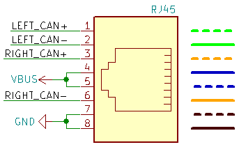
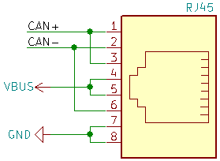
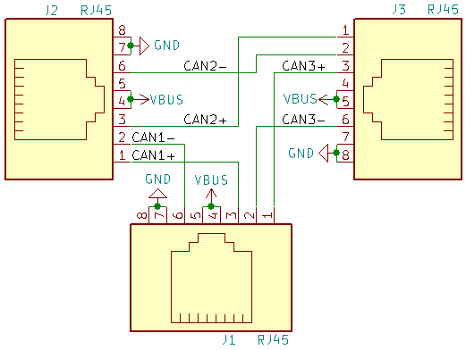
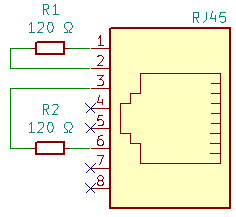

# Home automation communication network

_*Disclaimer:* This is not an officially supported Google product._

This project aims to create both SW and HW for an inexpensive home automation
communication network based on the
[CAN bus](https://en.wikipedia.org/wiki/CAN_bus) using common components and
infrastructure.

Eventually it will contain hardware plans
([KiCAD](https://en.wikipedia.org/wiki/KiCad)) and software to control
individual modules.

At the moment subdirectories contain work in progress, untested, and not
suitable for any use whatsoever.

## Design goals:

* Local with respect to network changes. That is, changing one part of the
  network should not require modification of the network as a whole.
* Easy to use. Adding or removing devices should be simple.
* Allow complex topologies, ideally multi-star.
* Use existing infrastructure - CAT 5 cables and RJ45 connectors.
* Universal - modules should be able to provide GPIO pins, as well as standard
  short-range communication buses such as I²C.
* Inexpensive.

See also
[Linearizing multi-star network for home automation](https://electronics.stackexchange.com/questions/512147/linearizing-multi-star-network-for-home-automation)
on StackExchange.

## Detailed design

### RJ45 connector for CAN

The project uses the standard [RJ45](https://en.wikipedia.org/wiki/RJ45)
connector and [CAT5](https://en.wikipedia.org/wiki/Category_5_cable) (or better
cables).

For power distribution it uses pins 4 and 5 for positive voltage and pins 7 and
8 for negative (ground) voltage. This is compatible with [Power over
Ethernet](https://en.wikipedia.org/wiki/Power_over_Ethernet). It should be
possible to use any _passive_ PoE injector up to 48V.

Pin pairs 1 & 2 and 3 & 6 are used for the CAN bus. The standard requires that
the CAN bus data connections form a serial bus. In order to support arbitrary
tree [topologies](https://en.wikipedia.org/wiki/Network_topology), each node in
the network provides a linar segment of a CAN bus. This linear segment goes
from pins 1 (_LEFT CAN+_) and 2 (_LEFT CAN-_) to pins 3 (_RIGHT CAN+_) and 6
(_RIGHT CAN-_). All these segments are then concatenated into a single serial
line.

A simple **end node** must connects pins 1-3 and 2-6 to connect the bus segment
"on its left" with the other segment "on its right". At the same time, it
connects its CAN transceiver to these pins and to the ground pins. It can also
draw power from the PoE positive voltage pins.

A **splitter node** just connects the power pins among all RJ45 connectors. The
data pin connections are more complicated: The CAN network "going from the
left" is first connected to one branch (CAN1), the "right" part of the branch
is connected to the "left" part of the other branch (CAN2), and finally
continues "to the right" (CAN3).

This corresponds to depth-first
[tree traversal](https://en.wikipedia.org/wiki/Tree_traversal) of the network.

Notice that the splitter node is fully symmetric. Therefore any connector can
be used as the one connected to the main network, and all the others as
branches. It can also split into more than two branches. However, in any case
**all branches must be connected** to nodes, even just to dummy ones that only
connect pins 1-3 and 2-6, in order to ensure that the whole network is
interconnected.

Finally, exactly one node on the network must be a **terminating node**, to
provide proper
[electrical termination](https://en.wikipedia.org/wiki/Electrical_termination).
Without such a node the whole network would form a ring and suffer from echoes
(see also [Signal reflection](https://en.wikipedia.org/wiki/Signal_reflection)).

## Contributions and future plans

Once a skeleton of the project becomes available, contributions will be
welcomed! Please see [Code of Conduct](docs/code-of-conduct.md) and
[Contributing](docs/contributing.md).
